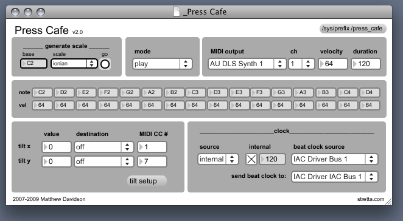

# presscafe

written by Matthew Davidson stretta.com

A real-time rhythmic MIDI pattern performance patch.

In press cafe one axis of the monome represents discrete notes, and the other axis represents repeating sequences of that note. Press Cafe creates different pitched rhythmic patterns based on which button is pressed. The patterns are represented by animating the LEDs. Each pattern can be edited directly on the monome. 

http://vimeo.com/375666